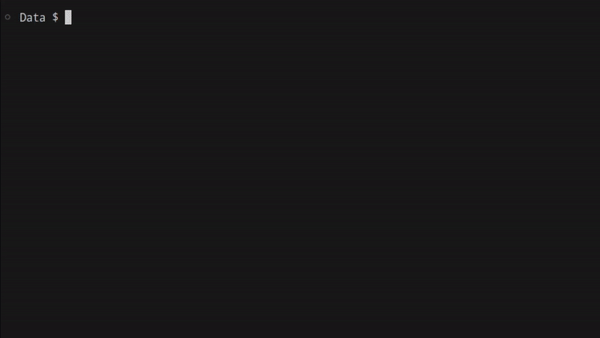

<h1 align="center">
    gotmx-todo
</h1>

<p align="center">
  <a href="#Summary">Summary</a> •
  <a href="#Installation">Installation</a> •
  <a href="#Build">Build</a> 
</p>


<h4 align="center">Todo app written in Go and HTMX compiled into single binary</h4>


# Summary
This is a single binary to do list webapp written in go with HTMX frontend, styled using Tailwind CSS. All frontend component (html, js, and css) were embedded into compiled binary so that the app can run as a single binary without external dependecies.

I wrote this to help me learn about programming web server with Go and how to use HTMX as a front end. I also wanted to explore the possibility of making browser-based application that can be packed into a single binary file for easy distribution.

# Installation
Just find the appropriate binary for your system on the [Release](https://github.com/perfect-less/gotmx-todo/releases) page. Just open the app and then open `http://localhost:8080` on your browser.

# Build
To build you would need to install Go compiler, refer to Go's [download page](https://go.dev/doc/install) for installation. It is also recommended for you to have git installed to easily clone the repository.

Here's how to build the app:

1. Clone the repo by running
```bash
$ git clone https://github.com/perfect-less/gotmx-todo
```

2. `cd` into the newly cloned repo
```bash
$ cd gotmx-todo
```

3. Build using go compiler
```bash
$ go build .
```

4. There should be `gotmx-todo` file (or `gotmx-todo.exe` on windows) that you can run by running the following command
```bash
$ ./gotmx-todo
```

